# 01. 탐색 + 의뢰

의뢰인이 **필요한 전문가·의뢰를 찾고**, 직접 **의뢰를 올리고**, 도착한 **제안서를 비교해 수락**하기까지의 흐름.

> 모든 화면은 [MSW 목업 데이터](../mock-and-capture.md)로 캡처했다. `pnpm capture explore` 로 재현할 수 있다.

[← 기능 목록](../../README.md#-주요-화면) · [02. 채팅 상담 플로우 →](./02-chat-flow.md)

---

## 홈

배너 캐러셀, 6개 대분류 카테고리, 인기 의뢰, 인기 전문가를 한 화면에 모았다. 배너·카테고리는 RSC 에서 미리 받아 첫 화면이 비어 보이지 않는다.

<table>
  <tr>
    <td width="72%" valign="top">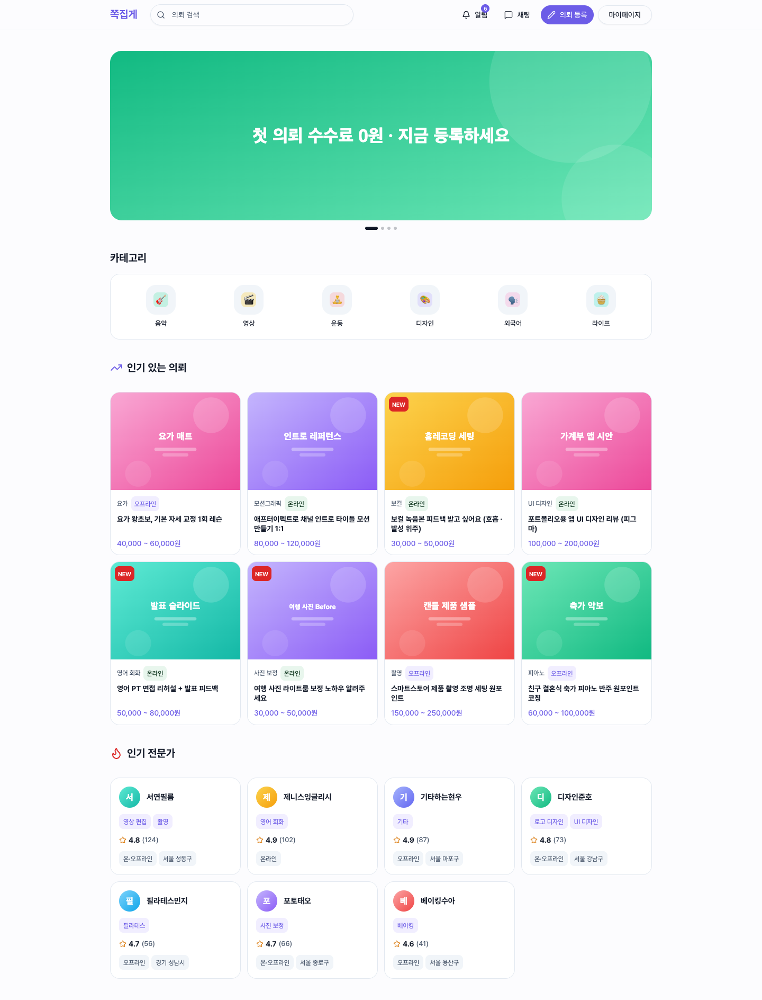</td>
    <td width="28%" valign="top">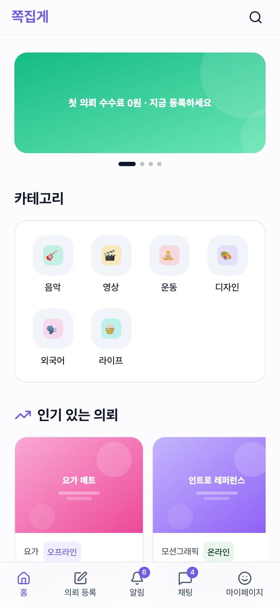</td>
  </tr>
</table>

## 카테고리 · 검색

- 카테고리 화면은 **의뢰 / 전문가 탭**과 중분류 사이드바로 나뉜다.
- 지역 · 유형(온라인/오프라인) · 정렬(최신순 / 예산 높은순 / 마감임박순) 필터를 제공한다.
- 카드마다 마감 D-day, 받은 제안 수, 등록 시각을 상대 시간으로 보여준다.

<table>
  <tr>
    <td width="72%" valign="top">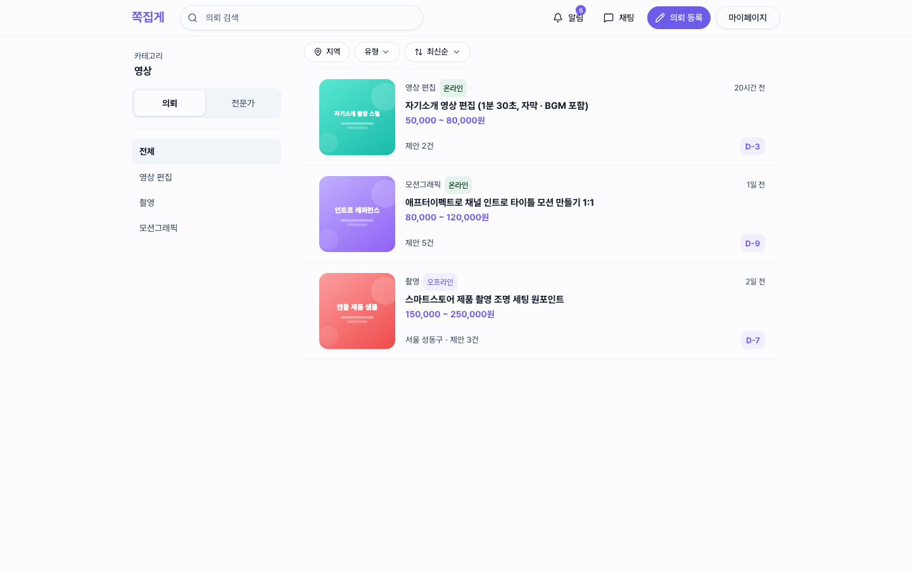</td>
    <td width="28%" valign="top">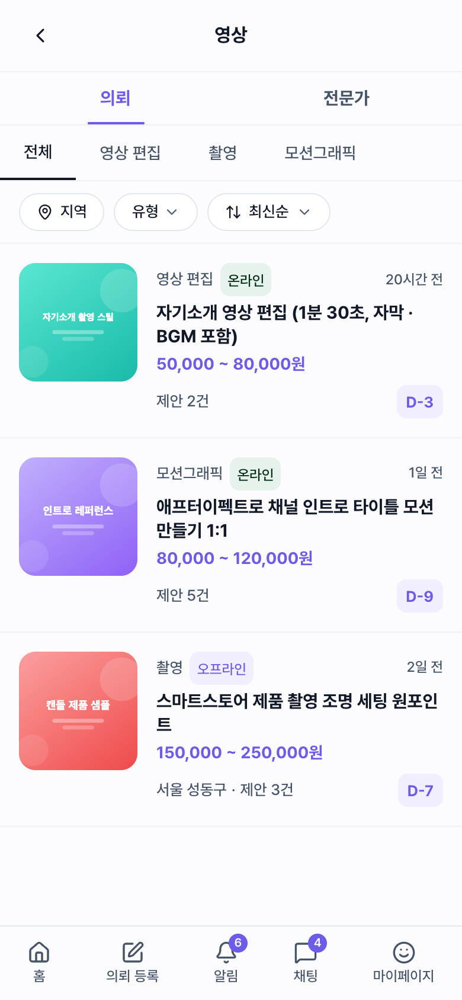</td>
  </tr>
  <tr>
    <td width="72%" valign="top">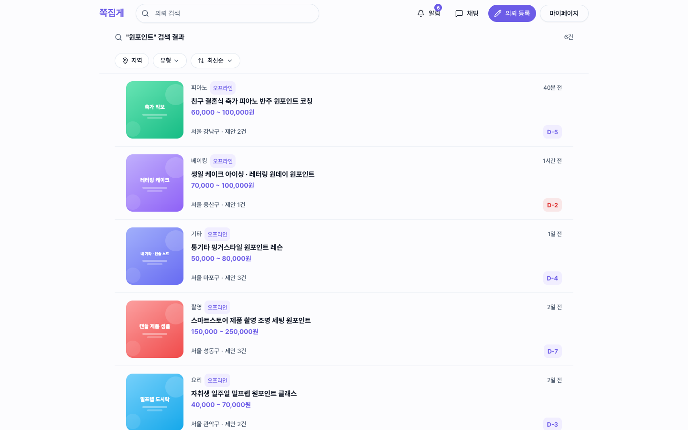</td>
    <td width="28%" valign="top">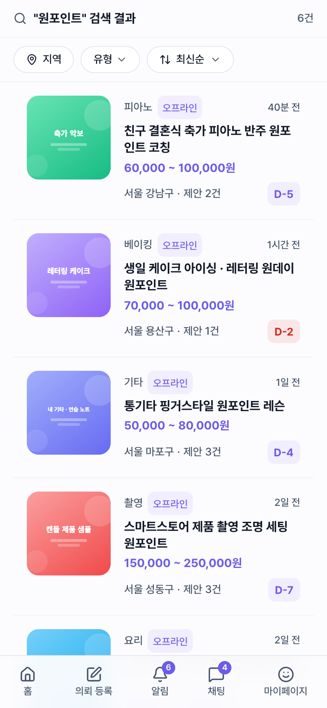</td>
  </tr>
</table>

## 전문가 프로필

배너 · 한 줄 소개 · 활동 지역 · 본인인증 배지 · 활동 시간 · 리뷰 평점 / 리뷰 수 / 매칭 수를 위에 두고, **소개 / 포트폴리오 / 자격증 / 리뷰** 탭으로 상세를 나눴다. 리뷰 탭은 [채팅 스냅샷 리뷰](./03-review.md)로 바로 이어진다.

<table>
  <tr>
    <td width="72%" valign="top">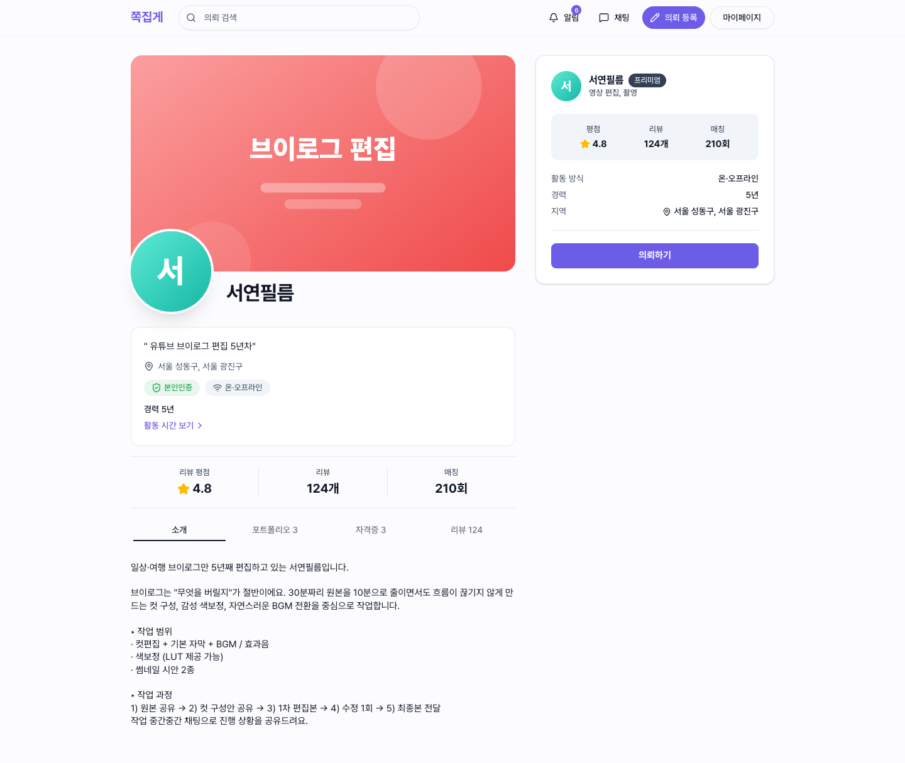</td>
    <td width="28%" valign="top">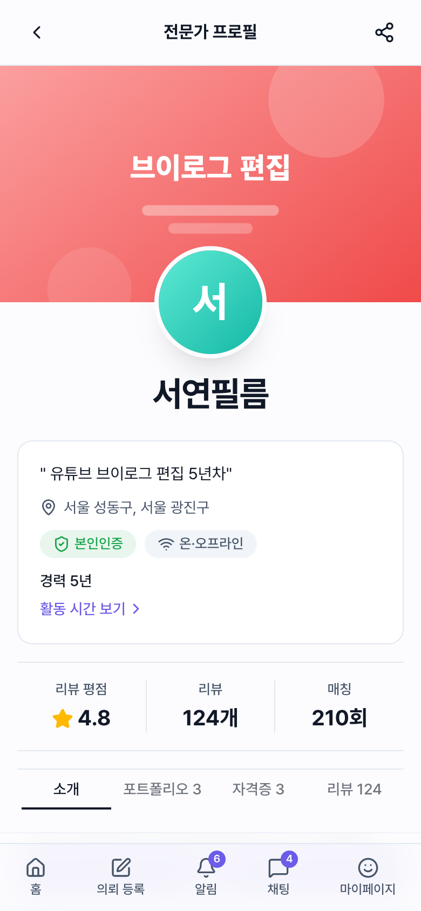</td>
  </tr>
</table>

## 의뢰 등록

**5단계 스텝 폼**(유형 & 카테고리 → 의뢰 내용 → 시간 & 예산 → 희망 일시 → 최종 확인). 온라인은 작업물 전달 + 에스크로 결제, 오프라인은 대면 서비스로 이후 흐름이 갈린다.
폼 상태와 검증은 `react-hook-form` + Zod v4 로 관리한다.

<table>
  <tr>
    <td width="72%" valign="top">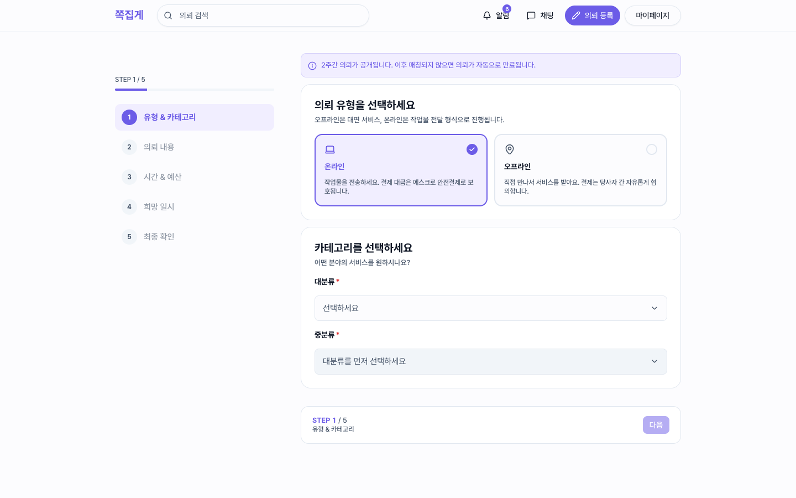</td>
    <td width="28%" valign="top">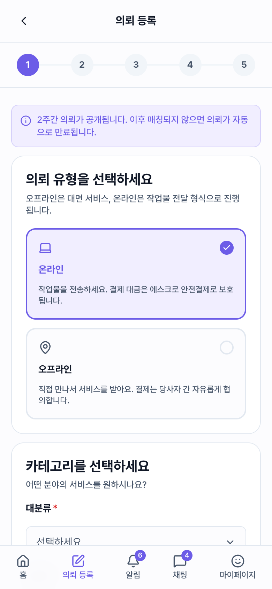</td>
  </tr>
</table>

## 의뢰 상세 · 받은 제안

- 의뢰 본문, 희망 일시 · 장소 · 마감일(D-day)을 보여준다.
- 아래에는 전문가들이 보낸 **제안서 카드**(금액 · 소요 시간 · 진행 방식)가 쌓인다.
- 데스크톱에서는 오른쪽 요약 카드가 sticky 로 따라온다.

<table>
  <tr>
    <td width="72%" valign="top">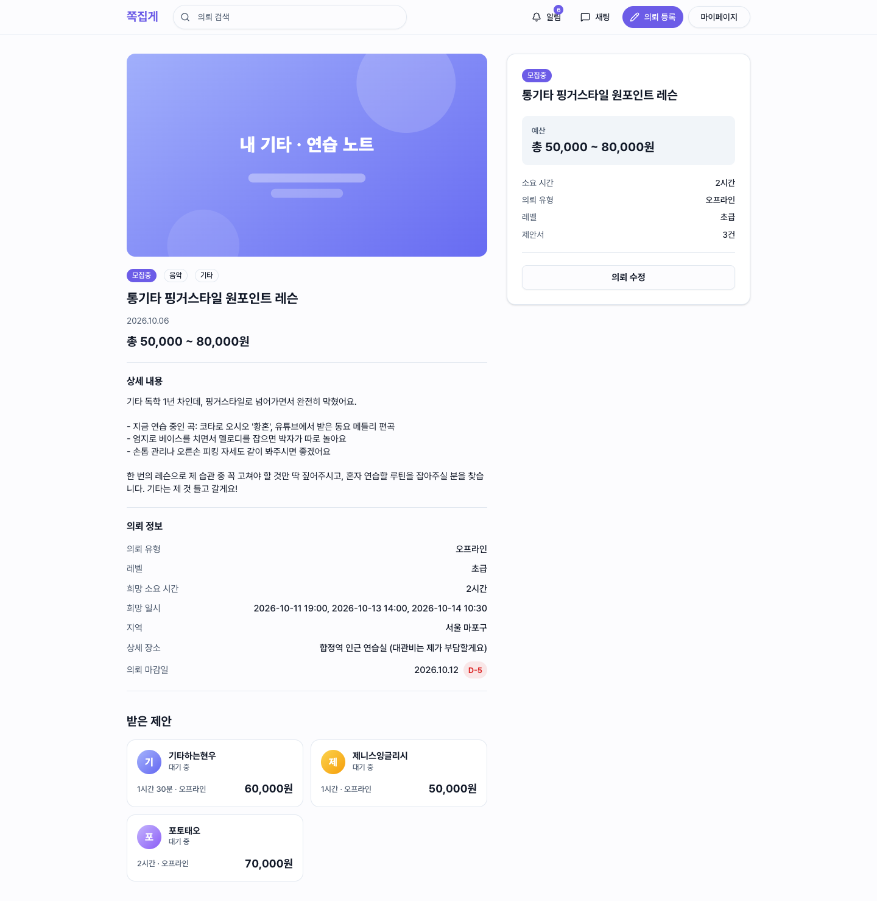</td>
    <td width="28%" valign="top">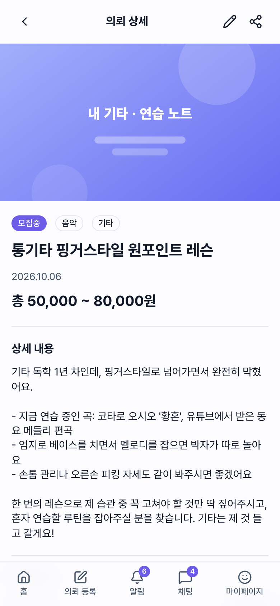</td>
  </tr>
</table>

## 제안서 상세 → 수락

전문가의 어필 메시지, 가능한 일정, 제안 금액과 진행 방식을 확인하고 **수락**하면 채팅방이 열린다. 거래는 [채팅 상담 플로우](./02-chat-flow.md)로 이어진다.

<table>
  <tr>
    <td width="72%" valign="top">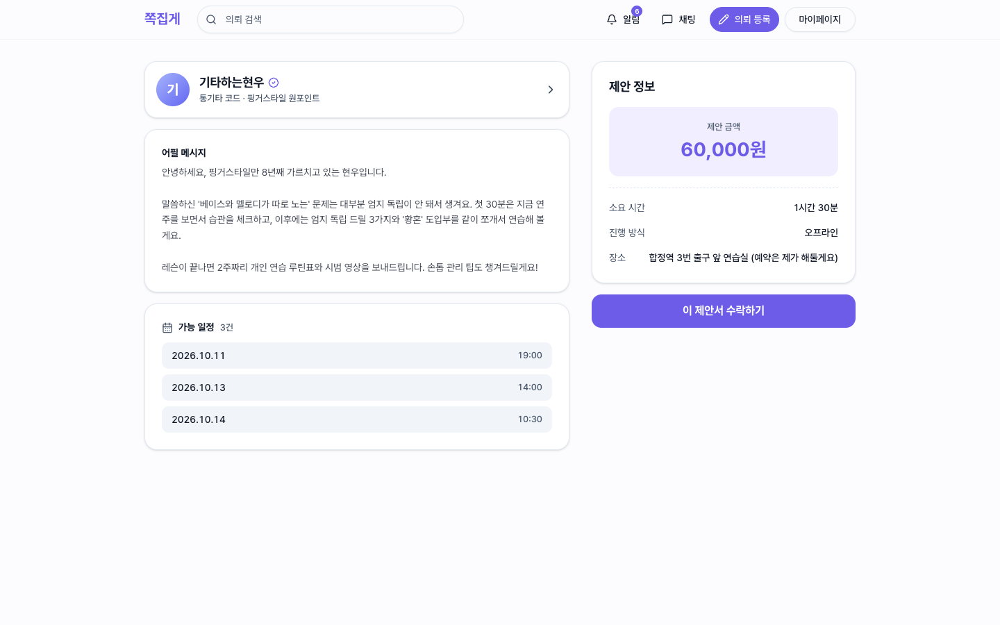</td>
    <td width="28%" valign="top">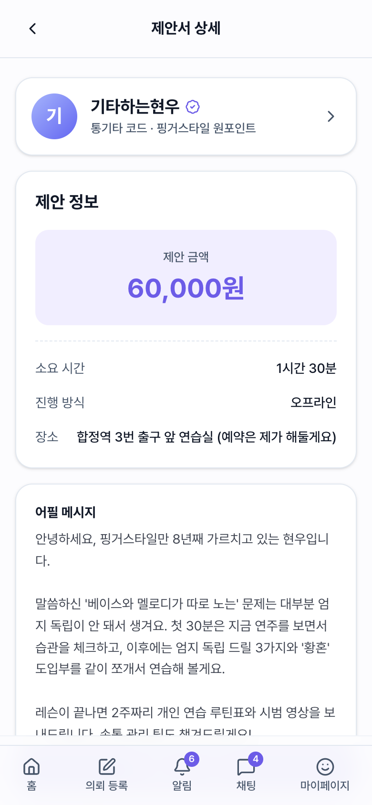</td>
  </tr>
</table>
