# 02. 채팅 상담 플로우

제안서를 수락한 순간부터 **거래가 끝날 때까지 모든 단계가 채팅방 안에서** 진행된다.
합의서 작성 → 에스크로 결제 → 작업물 제출 → 검수(승인 / 수정 요청 / 거절) → 거래 완료. 문제가 생기면 같은 자리에서 환불 요청과 분쟁으로 넘어간다.

> 모든 화면은 [MSW 목업 데이터](../mock-and-capture.md)로 캡처했다. `pnpm capture chat` 으로 재현할 수 있다.

[← 01. 탐색 + 의뢰](./01-explore-and-ticket.md) · [03. 리뷰 →](./03-review.md)

---

## 채팅 목록

- **전체 / 진행중 / 완료** 탭으로 나뉜다.
- 방마다 상대 · 의뢰 제목 · 마지막 메시지 · 안 읽은 수를 보여준다.
- 데스크톱은 목록과 대화가 나란히 놓이는 2단, 모바일은 목록 → 대화로 화면이 넘어가는 구조다.

<table>
  <tr>
    <td width="72%" valign="top">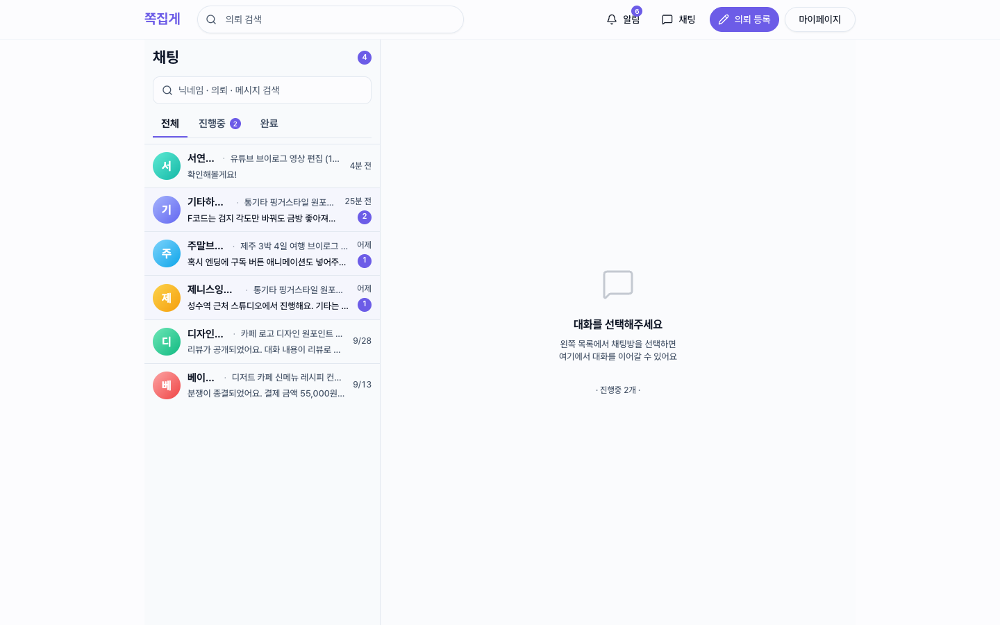</td>
    <td width="28%" valign="top">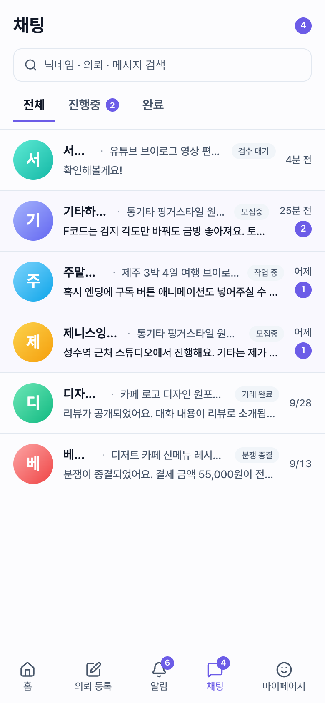</td>
  </tr>
</table>

## 채팅방 — 진행 단계와 의뢰 카드

상단 **진행 스테퍼**(매칭 → 합의·결제 → 작업 진행 → 검수 → 거래 완료)가 지금 거래가 어디에 있는지 보여준다.
그 아래 배너는 서버가 내려주는 `banner.type` 에 따라 바뀐다(서버 드리븐 UI). 합의서 작성 필요, 결제 대기, 작업물 제출 필요, 재제출 필요, 환불 진행 중 등의 상태가 있다.

<table>
  <tr>
    <td width="72%" valign="top">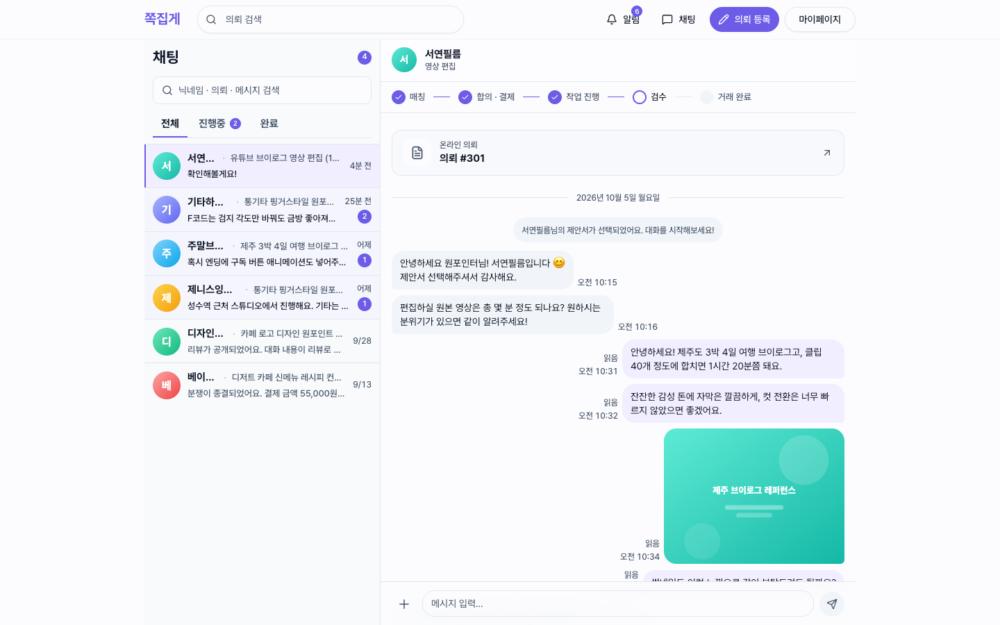</td>
    <td width="28%" valign="top">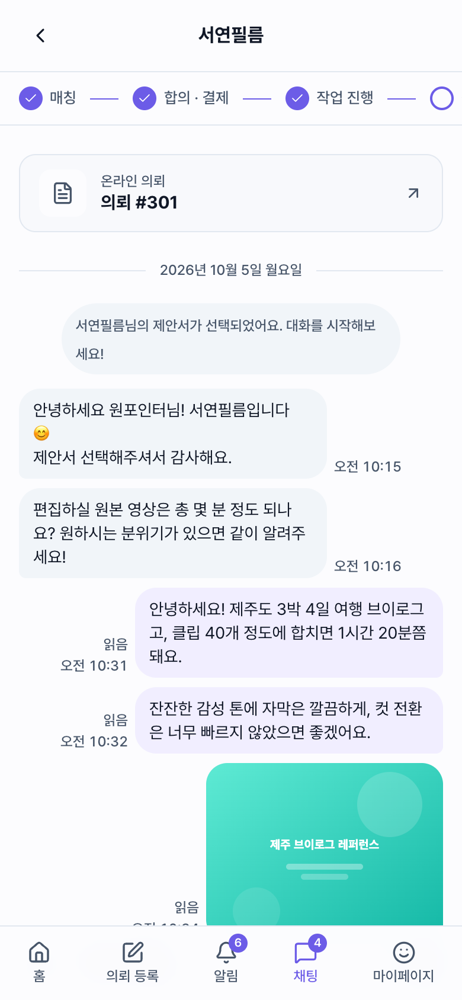</td>
  </tr>
</table>

## 채팅방 — 메시지 타입

텍스트 · 이미지 · 파일 · **합의서** · **작업물** · 시스템 메시지를 한 타임라인에 그린다.

- 결제 완료처럼 거래 상태가 바뀌면 시스템 메시지가 들어간다.
- 날짜 구분선과 읽음 표시가 있다.
- 실시간 송수신은 STOMP over WebSocket 으로 한다.

<table>
  <tr>
    <td width="72%" valign="top">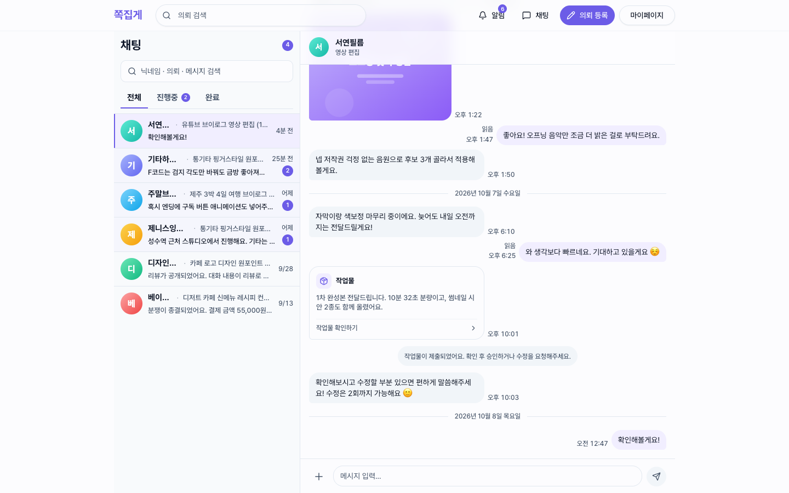</td>
    <td width="28%" valign="top">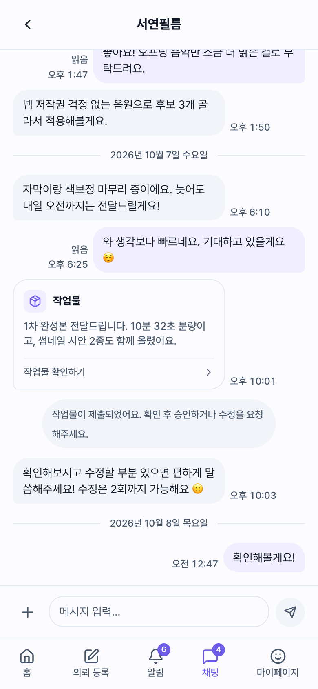</td>
  </tr>
</table>

## 합의서 상세

합의서 버블을 누르면 최종 금액 · 작업 마감일 · 작업 범위 · 수정 가능 횟수 · 납품 형식 · 상태를 확인할 수 있다.
합의가 확정되면 **에스크로 결제**(PortOne)로 넘어간다. 결제 금액은 의뢰인이 작업물을 승인할 때까지 플랫폼이 보관한다.

<table>
  <tr>
    <td width="72%" valign="top">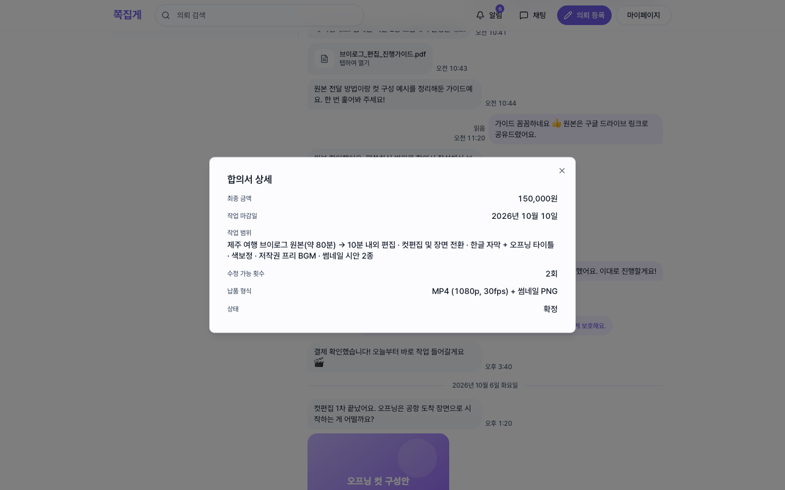</td>
    <td width="28%" valign="top">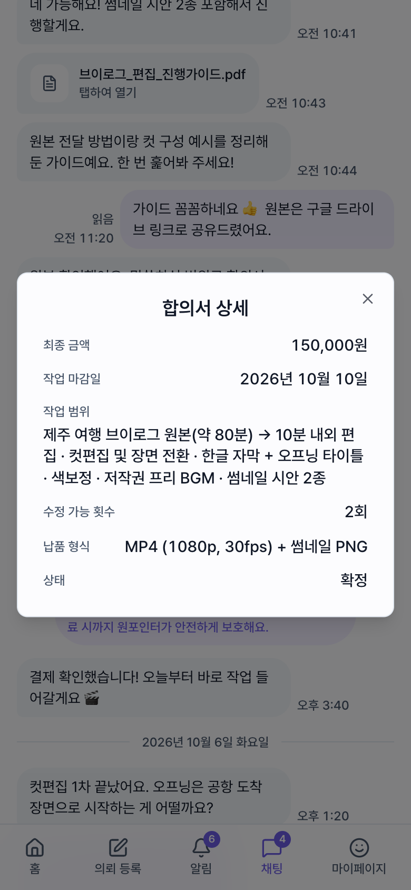</td>
  </tr>
</table>

## 작업물 검수

작업물 버블을 누르면 전문가의 메모, 이미지 · 파일 첨부, 남은 수정 횟수를 보고 **승인 / 수정 요청 / 거절**을 고를 수 있다.
승인하면 거래가 완료되고 [리뷰](./03-review.md) 단계로 넘어간다.

모든 다이얼로그는 `overlay-kit` 명령형 오프너(`openDeliveryReview()` 등)로 열린다. 결과는 Promise 로 돌려받는다.

<table>
  <tr>
    <td width="72%" valign="top">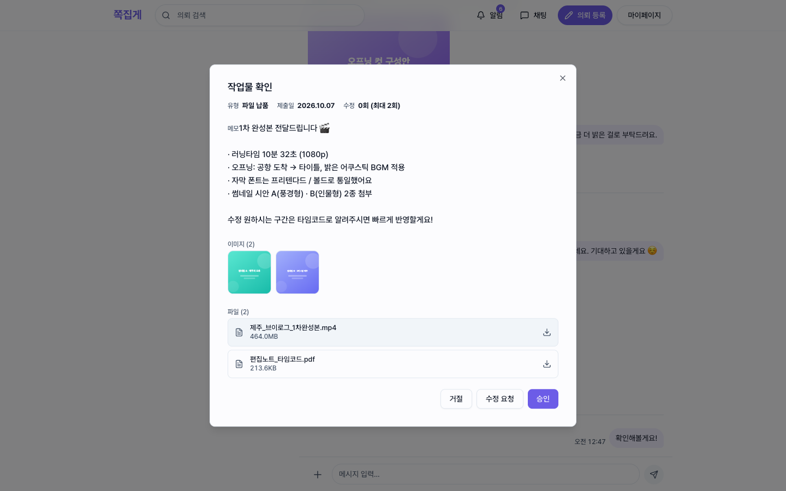</td>
    <td width="28%" valign="top">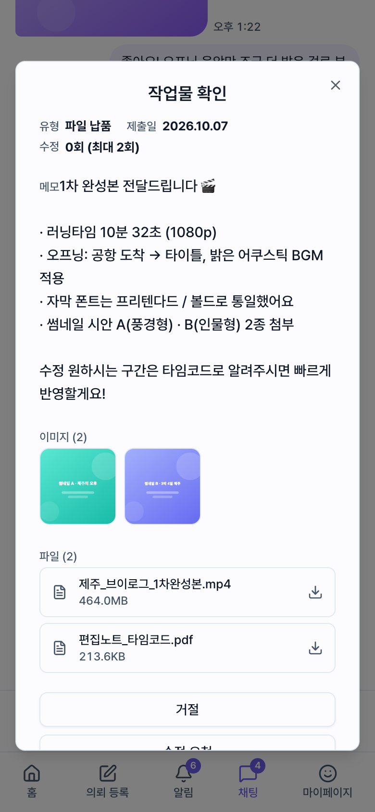</td>
  </tr>
</table>

## 전문가 시점

같은 계정이 **전문가 모드**로 전환하면, 내가 제안해서 진행 중인 거래의 채팅방이 같은 컴포넌트로 열린다.
메시지 정렬과 배너 액션(작업물 제출 등)은 `myRole` 에 따라 달라진다.

<table>
  <tr>
    <td width="72%" valign="top">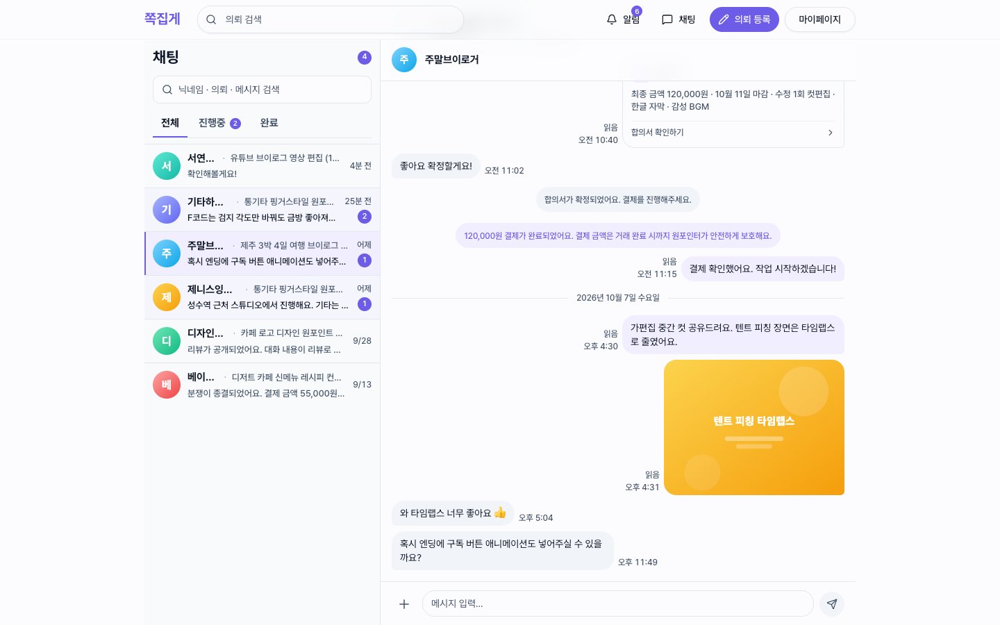</td>
    <td width="28%" valign="top">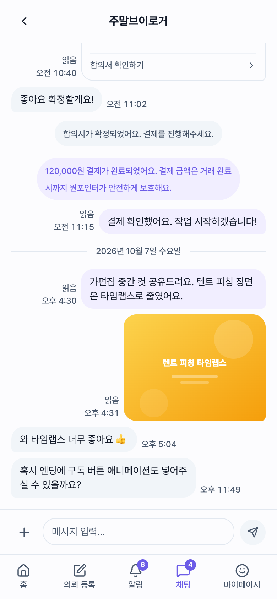</td>
  </tr>
</table>
