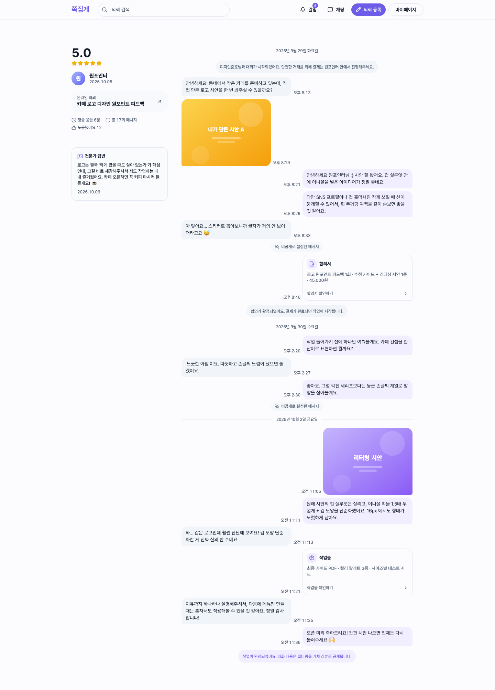
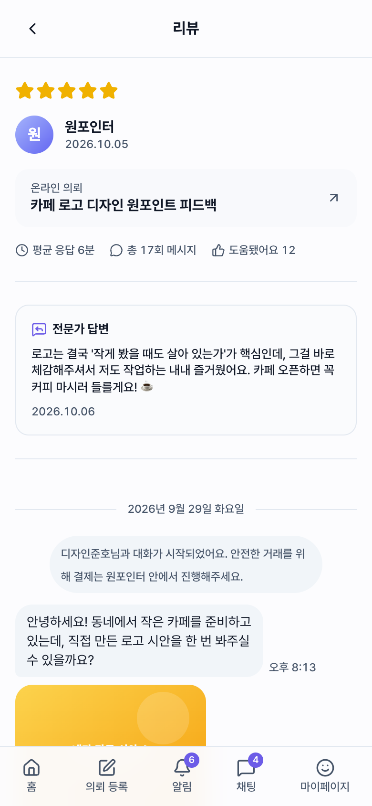
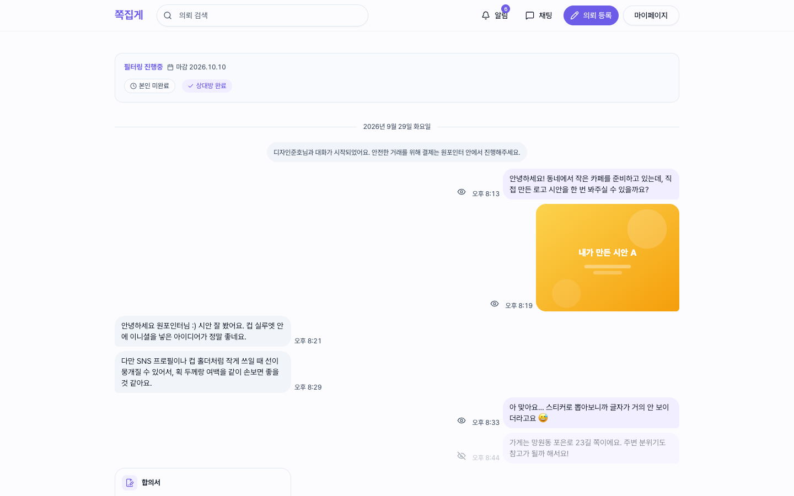
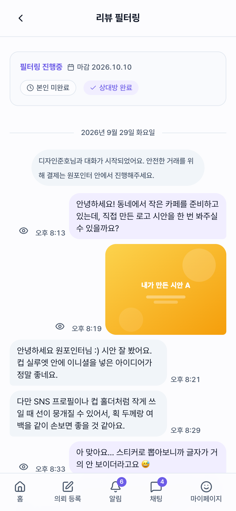
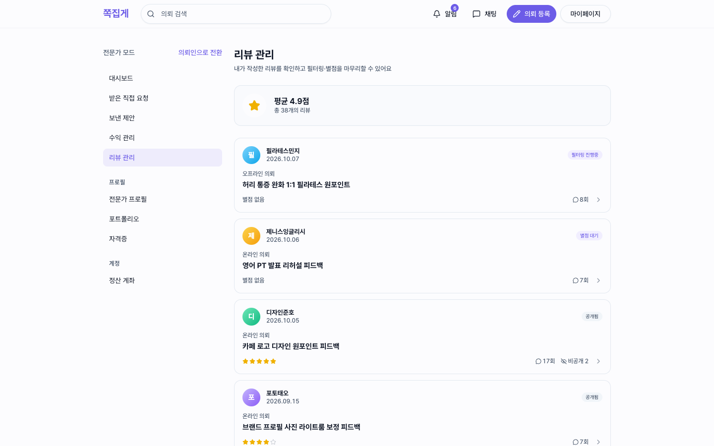
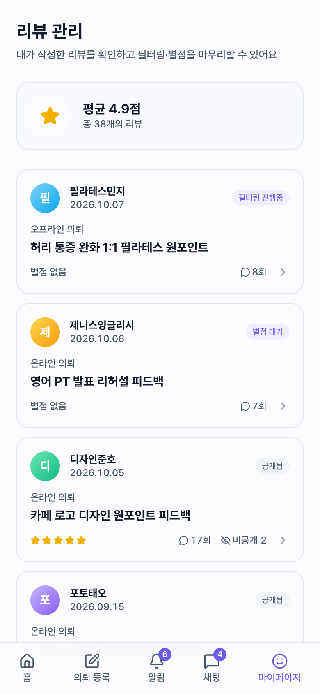

# 03. 리뷰 — 채팅 스냅샷 공개

원포인터의 리뷰는 별점과 몇 줄짜리 후기가 아니다. **거래 과정의 실제 대화 자체**를 공개한다.
다음 의뢰인은 이 전문가가 어떻게 소통하고 어떻게 작업했는지를 대화 원문으로 확인할 수 있다.

```
거래 완료 → 스냅샷 생성 → 필터링(양측이 자기 메시지 비공개 처리) → 별점 → 공개
SNAPSHOT_CREATED → FILTERING → WAITING_RATING → PUBLISHED
```

> 모든 화면은 [MSW 목업 데이터](../mock-and-capture.md)로 캡처했다. `pnpm capture review` 로 재현할 수 있다.

[← 02. 채팅 상담 플로우](./02-chat-flow.md) · [04. 마이페이지 + 알림 →](./04-mypage.md)

---

## 리뷰 상세

- 왼쪽: 별점 · 작성자 · 원래 의뢰 링크 · 평균 응답 시간 · 메시지 수 · "도움됐어요" · 전문가 답변
- 오른쪽: 공개된 대화 스냅샷

합의서 · 작업물 버블도 스냅샷 안에 읽기 전용으로 다시 그려진다. 같은 버블 컴포넌트를 `onClick` 없이 재사용한다.
비공개 처리된 메시지는 "비공개로 설정된 메시지" 자리표시로만 남는다.

<table>
  <tr>
    <td width="72%" valign="top"></td>
    <td width="28%" valign="top"></td>
  </tr>
</table>

## 필터링 — 공개 전 내 메시지 가리기

거래가 끝나면 양측에 **필터링 기간**이 주어진다.

- 내 메시지마다 눈 아이콘 토글이 있다. 숨길 때는 사유를 고른다.
- 상단 배너에 마감일과 "본인 미완료 / 상대방 완료" 진행 상태가 표시된다.
- 주소처럼 민감한 내용은 공개 전에 직접 가릴 수 있다.

<table>
  <tr>
    <td width="72%" valign="top"></td>
    <td width="28%" valign="top"></td>
  </tr>
</table>

## 리뷰 관리

내가 참여한 리뷰를 상태별 배지(필터링 진행중 / 별점 대기 / 공개됨)와 함께 모아 본다.
카드를 누르면 상태에 맞는 화면으로 이동한다. 필터링 중이면 필터링 화면, 공개됐으면 상세 화면이다.

<table>
  <tr>
    <td width="72%" valign="top"></td>
    <td width="28%" valign="top"></td>
  </tr>
</table>
