# 04. 마이페이지 + 알림

한 계정이 **의뢰인과 전문가 역할을 오가며** 쓸 수 있다. 마이페이지는 역할 토글에 따라 사이드바 메뉴와 대시보드가 통째로 바뀐다.

> 모든 화면은 [MSW 목업 데이터](../mock-and-capture.md)로 캡처했다. `pnpm capture mypage` 로 재현할 수 있다.

[← 03. 리뷰](./03-review.md) · [기능 목록 →](../../README.md#-주요-화면)

---

## 대시보드 — 의뢰인 / 전문가 모드

- **의뢰인 모드**: 모집 중 · 진행 중 · 완료 의뢰 수, 작성한 리뷰 수
- **전문가 모드**: 대기 제안 · 진행 중 · 완료 건수, 평균 평점. 포트폴리오와 정산 계좌로 가는 바로가기가 붙는다.
- 역할은 zustand `persist` 스토어에 저장되어 새로고침해도 유지된다.

<table>
  <tr>
    <td width="72%" valign="top">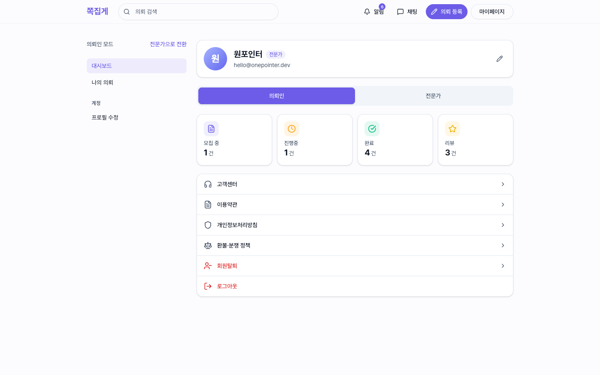</td>
    <td width="28%" valign="top">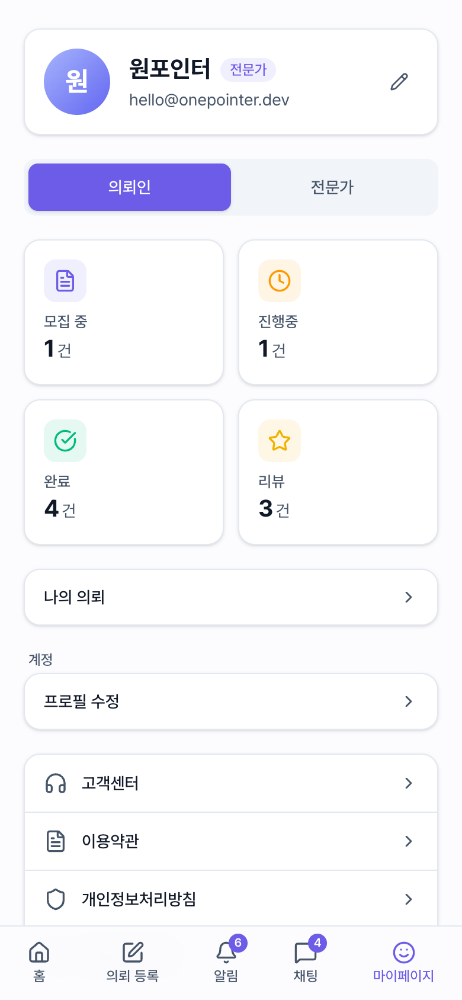</td>
  </tr>
  <tr>
    <td width="72%" valign="top">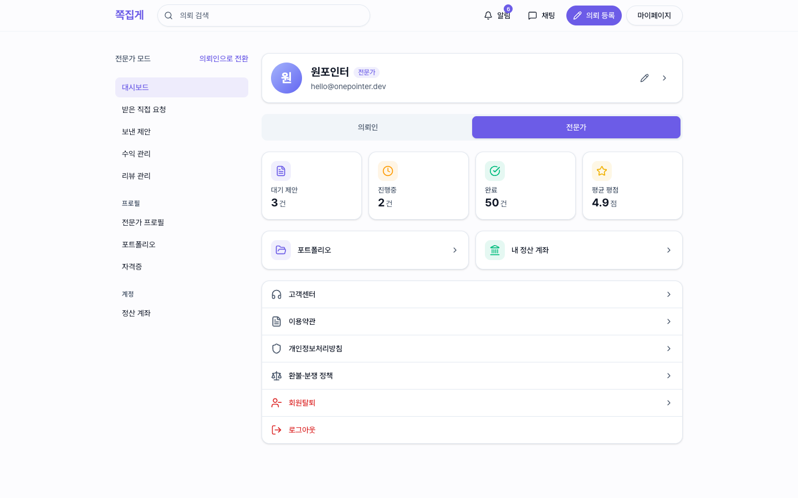</td>
    <td width="28%" valign="top">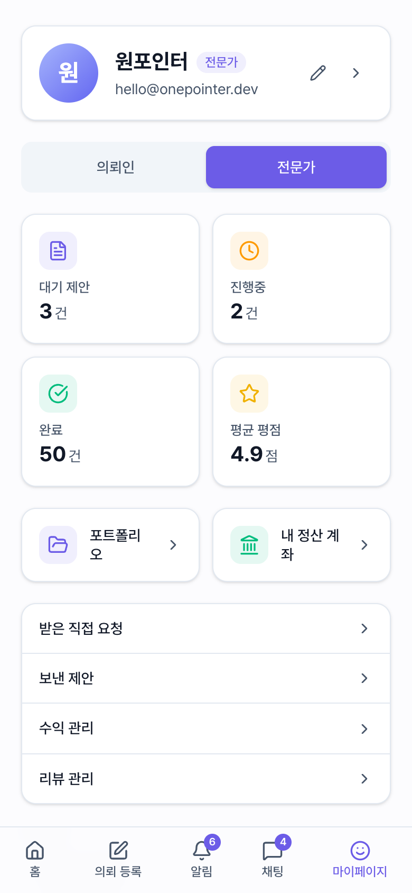</td>
  </tr>
</table>

## 나의 의뢰

내가 올린 의뢰를 **모집중 / 진행중 / 완료** 탭으로 나눠 본다. 모집 중인 의뢰에는 받은 제안 수가 함께 표시된다.

<table>
  <tr>
    <td width="72%" valign="top">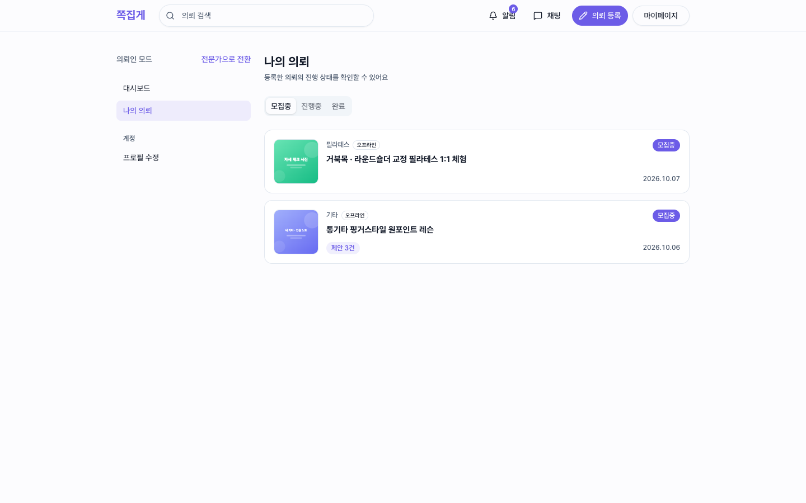</td>
    <td width="28%" valign="top">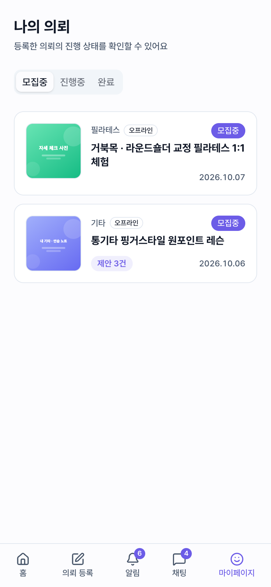</td>
  </tr>
</table>

## 수익 관리 (전문가)

- 일간 · 주간 · 월간 기간 토글
- 순수익과 정산 완료 / 정산 대기 금액, 수수료 합계, 정산 계좌
- 기간별 수익 추이 막대 차트
- 거래 내역: 정산 상태 필터, 예상 정산일

<table>
  <tr>
    <td width="72%" valign="top">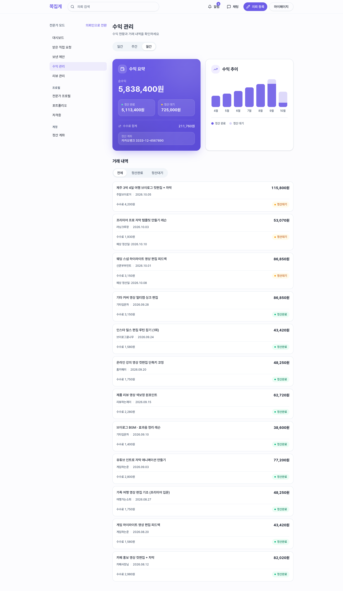</td>
    <td width="28%" valign="top">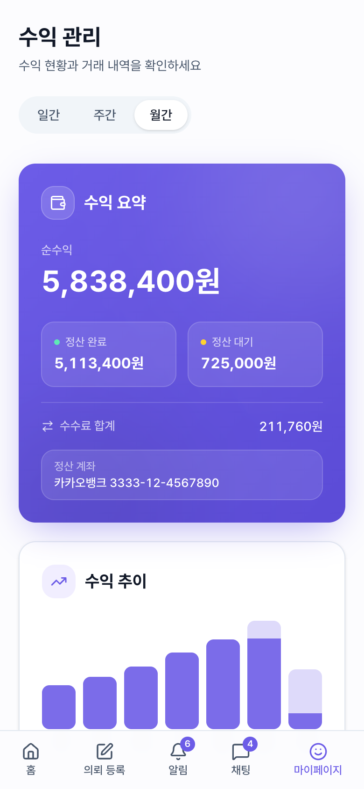</td>
  </tr>
</table>

## 포트폴리오 (전문가)

작업 사례를 이미지와 함께 등록 · 수정 · 삭제한다. 등록한 포트폴리오는 [전문가 프로필](./01-explore-and-ticket.md#전문가-프로필)의 포트폴리오 탭에 노출된다.

<table>
  <tr>
    <td width="72%" valign="top">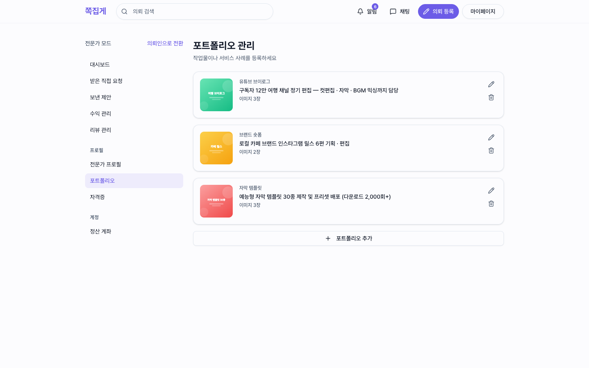</td>
    <td width="28%" valign="top">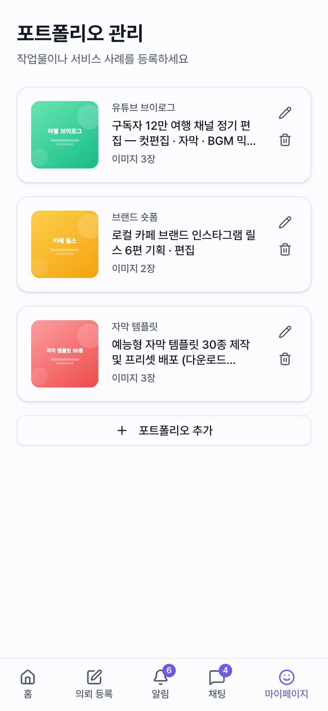</td>
  </tr>
</table>

## 알림

새 메시지 · 작업물 도착 · 제안서 도착 · 직접 요청 · 리뷰 공개 · 결제 / 합의 확정 등 거래 이벤트를 **전체 / 의뢰 / 거래** 탭으로 나눠 보여준다.
안 읽은 알림은 헤더와 하단 네비게이션 배지에 개수로 표시되고, "모두 읽음"으로 한 번에 정리할 수 있다.

<table>
  <tr>
    <td width="72%" valign="top">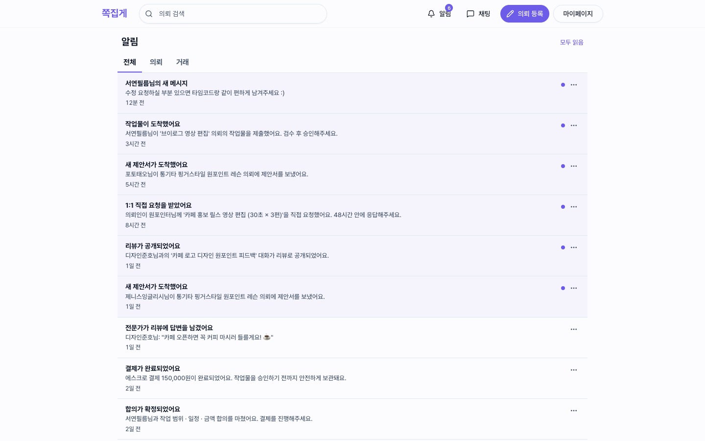</td>
    <td width="28%" valign="top">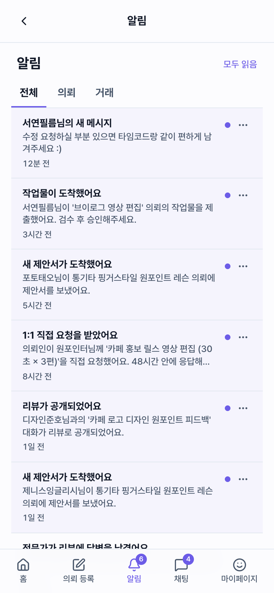</td>
  </tr>
</table>

## 로그인

이메일 로그인과 카카오 · Google · Apple 소셜 로그인. 인증은 쿠키 기반이다. 401 응답을 받으면 CSR · SSR 양쪽 경로에서 refresh token 으로 자동 재발급한다.

<table>
  <tr>
    <td width="72%" valign="top">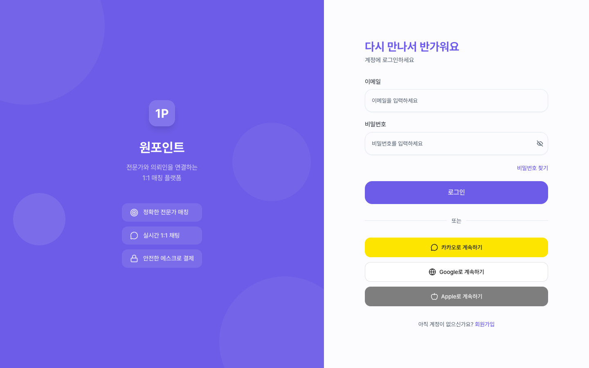</td>
    <td width="28%" valign="top">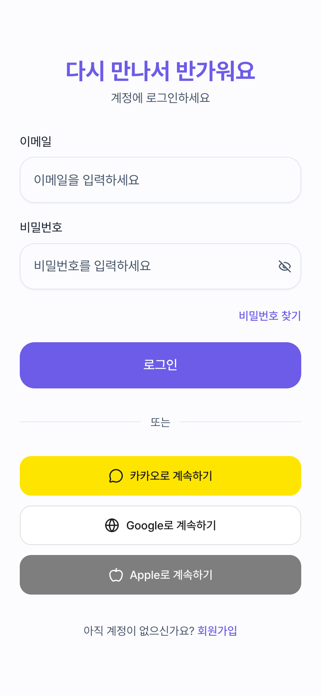</td>
  </tr>
</table>
